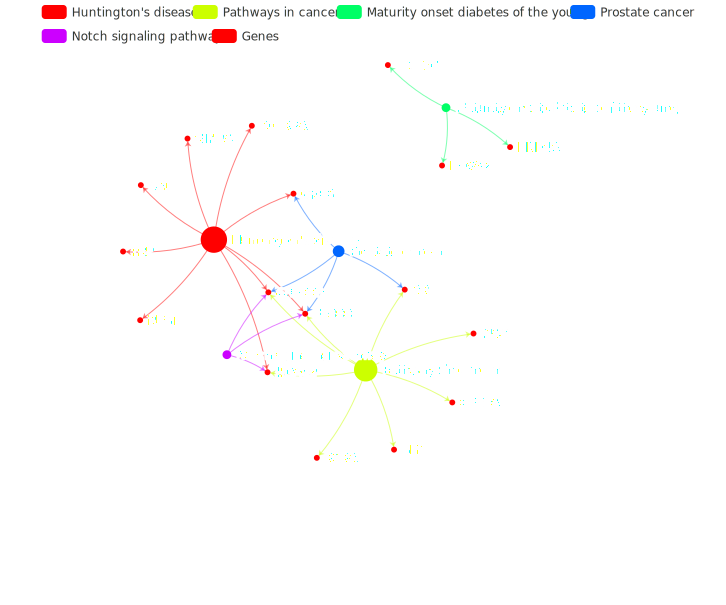

### Overview

**annoTools** is an R package providing an extensive library of plotting and data functions for use in GEO analysis.

<https://xiayh17.github.io/annoTools/>

### Getting started

If you are just getting started with **annoTools**, you can install by

``` r
# install.packages("devtools")
devtools::install_github('xiayh17/devtools')
```

### Example

``` r
# analyse
enrichKK <- enrichKEGG(gene         =  gene_up,
                       organism     = 'hsa',
                       #universe     = gene_all,
                       pvalueCutoff = 0.1,
                       qvalueCutoff = 0.1,
                       use_internal_data = T)

# make name readable
library(clusterProfiler)
library(org.Hs.eg.db)
surGenes = read.table('https://cdn.jsdelivr.net/gh/xiayh17/annoTools@main/dev/genelist.txt')[,1]#change dataframe to vector
head(surGenes)
dd <- AnnoProbe::annoGene(surGenes,ID_type = "SYMBOL")
df <- bitr(unique(surGenes), fromType = "SYMBOL",
           toType = c( "ENTREZID" ),
           OrgDb = org.Hs.eg.db)
head(df)
# entrezid are a series of numbers that fit into enrichGo,enrichKEGG:367
# https://biit.cs.ut.ee/gprofiler/convert
gene_up = df$ENTREZID
# analyse
enrichKK <- enrichKEGG(gene         =  gene_up,
                       organism     = 'hsa',
                       #universe     = gene_all,
                       pvalueCutoff = 0.1,
                       qvalueCutoff = 0.1,
                       use_internal_data = T)

# make name readable
enrichKK <- DOSE::setReadable(enrichKK, OrgDb='org.Hs.eg.db',keyType='ENTREZID')

# plot
cneteplot(enrichKK)
```

[](https://cdn.jsdelivr.net/gh/xiayh17/annoTools@main/dev/example.svg)
